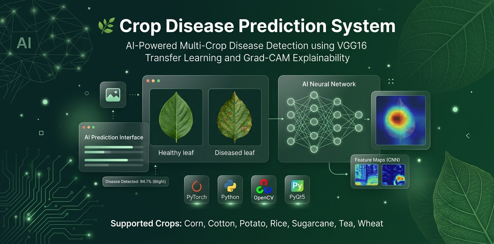
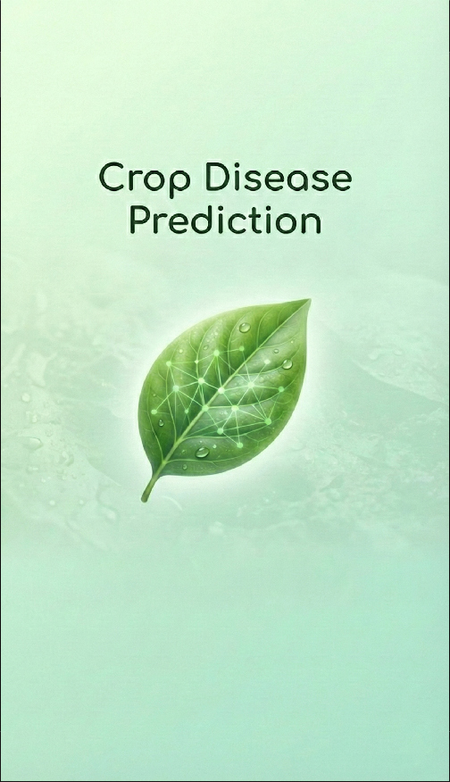
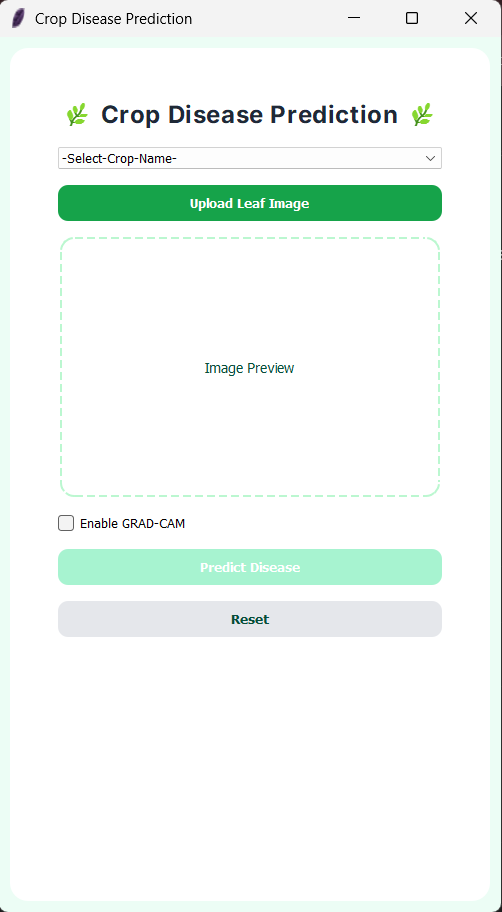
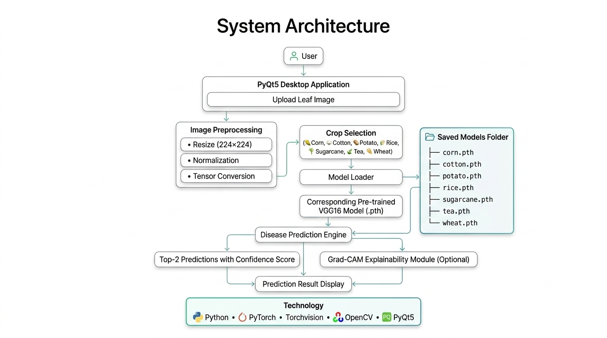
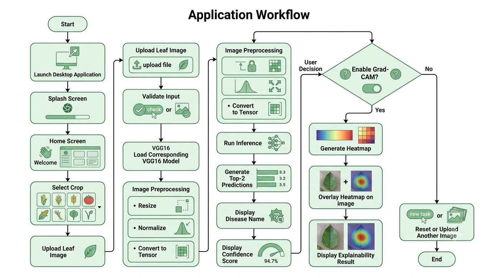
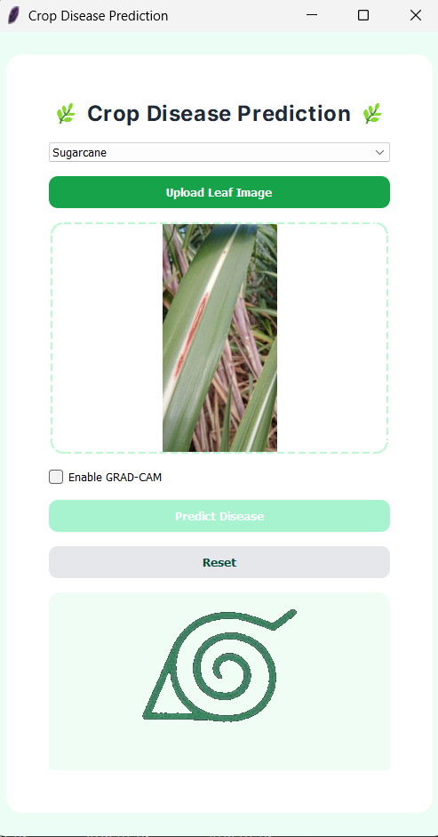
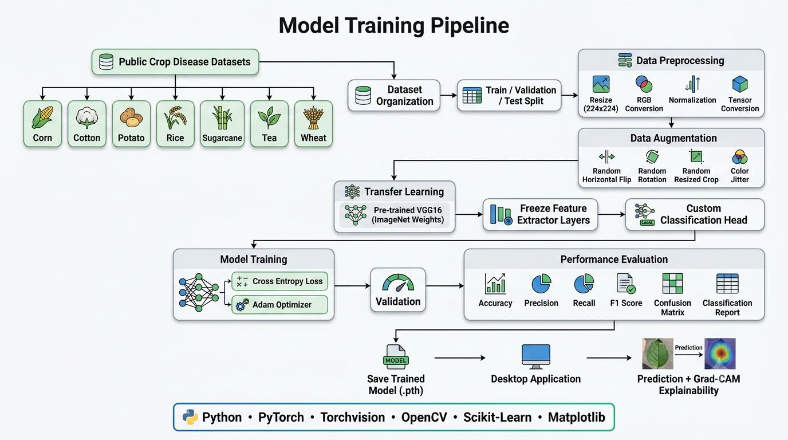
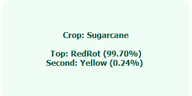
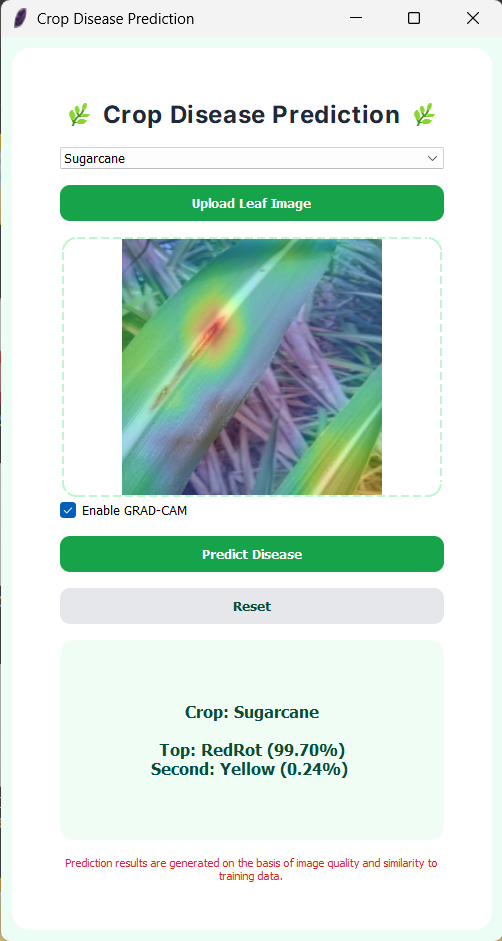

<div align="center">



<br/>

# 🌾 Crop Disease Prediction System

### AI-Powered Desktop Application for Multi-Crop Disease Diagnosis using Deep Learning, Transfer Learning & Explainable AI

<br/>

[](https://www.python.org/)
[](https://pytorch.org/)
[](https://pypi.org/project/PyQt5/)
[](https://opencv.org/)
[](LICENSE)

[](https://github.com/abhay-baliyan/Crop-Disease-Prediction-System/stargazers)
[](https://github.com/abhay-baliyan/Crop-Disease-Prediction-System/commits/main)
[](https://github.com/abhay-baliyan/Crop-Disease-Prediction-System)
[](https://github.com/abhay-baliyan/Crop-Disease-Prediction-System/issues)

<br/>

**[Overview](#-project-overview) • [Features](#-key-features) • [Architecture](#️-system-architecture) • [Workflow](#-application-workflow) • [Installation](#️-installation) • [Model Details](#-model-details) • [Research](#-research-contribution)**

</div>

<br/>

<div align="center">

<br/>
<sub>🎬 Application launch experience</sub>
</div>

<br/>

---

## 📖 Project Overview

Crop diseases are responsible for substantial yield losses worldwide every year, directly threatening food security and the livelihoods of farmers who often lack timely access to agricultural experts. Early and accurate diagnosis is one of the most effective levers for minimizing crop loss — yet in most farming regions, diagnosis still depends on manual visual inspection, which is slow, inconsistent, and prone to human error.

**Crop Disease Prediction System** addresses this gap with a desktop application that brings deep learning-based diagnosis directly to the end user. By leveraging **Transfer Learning with VGG16** pretrained on ImageNet, the system learns robust visual representations of leaf diseases across seven major crops without requiring massive amounts of crop-specific training data — making it practical to train and deploy even with modest datasets.

Prediction alone, however, is not enough for a domain like agriculture where trust and interpretability matter. This is why the system integrates **Grad-CAM (Gradient-weighted Class Activation Mapping)**, which visually highlights the exact regions of a leaf that influenced the model's decision. Instead of treating the model as a black box, users can *see* what the AI is looking at — building confidence in the diagnosis and enabling more informed action.

The result is a self-contained, offline-capable desktop tool that combines predictive accuracy with visual explainability, designed to be usable by researchers, students, and agricultural stakeholders alike.

<br/>

<div align="center">

<br/>
<sub>🏠 Home screen — crop selection and main navigation</sub>
</div>

---

## ✨ Key Features

<div align="center">

| 🔍 Capability | 📋 Description |
|:---|:---|
| 🌱 **Multi-Crop Prediction** | Diagnoses diseases across seven independent, crop-specific AI models |
| 🧠 **Transfer Learning Backbone** | Built on VGG16, pretrained on ImageNet for strong feature extraction |
| ⚡ **Automatic Model Loading** | Crop-specific models load dynamically based on user selection |
| 📤 **Simple Image Upload** | Clean, intuitive image upload workflow for leaf samples |
| 🏆 **Top-2 Predictions** | Displays the two most probable disease classes for better decision support |
| 📊 **Confidence Scores** | Every prediction is paired with a transparent confidence percentage |
| 🔥 **Grad-CAM Explainability** | Visual heatmaps reveal exactly what the model "sees" |
| 🖥️ **CPU / GPU Auto-Detection** | Automatically utilizes GPU acceleration when available |
| 🎬 **Splash Screen** | Polished startup experience for a production-grade feel |
| 🎨 **Modern PyQt5 GUI** | Clean, responsive desktop interface built with PyQt5 |

</div>

---

## 🌾 Supported Crops

<div align="center">

| # | Crop | Model Type |
|:---:|:---|:---|
| 1 | 🌽 Corn | VGG16 Transfer Learning |
| 2 | ☁️ Cotton | VGG16 Transfer Learning |
| 3 | 🥔 Potato | VGG16 Transfer Learning |
| 4 | 🌾 Rice | VGG16 Transfer Learning |
| 5 | 🎋 Sugarcane | VGG16 Transfer Learning |
| 6 | 🍃 Tea | VGG16 Transfer Learning |
| 7 | 🌿 Wheat | VGG16 Transfer Learning |

</div>

> Each crop is served by an **independently trained model**, allowing disease-specific feature learning rather than a single generalized classifier.

---

## 🏗️ System Architecture

<div align="center">

</div>

The system is organized into clearly separated modules, each responsible for a single concern:

| Module | Responsibility |
|:---|:---|
| **`ui/`** | PyQt5-based desktop interface — handles user interaction, image display, and result rendering |
| **`inference/`** | Loads trained VGG16 models and performs disease prediction on input images |
| **`explainability/`** | Generates Grad-CAM heatmaps to visualize model decision regions |
| **`model_training/`** | Training scripts, data augmentation, and fine-tuning logic for each crop model |
| **`saved_models/`** | Stores trained `.pt` / `.pth` model weights for each supported crop |
| **`results/`** | Stores evaluation outputs, metrics, and generated reports |

This separation of concerns keeps the inference pipeline decoupled from the GUI layer, making the codebase easier to test, extend, and maintain.

---

## 🔄 Application Workflow

<div align="center">

</div>

1. **Launch** — The application starts with a splash screen while models initialize in the background.
2. **Crop Selection** — The user selects the target crop from the available list.
3. **Model Loading** — The corresponding crop-specific VGG16 model is loaded into memory (GPU if available, otherwise CPU).
4. **Image Upload** — The user uploads a leaf image through the GUI.
5. **Preprocessing** — The image is resized, normalized, and converted into a tensor suitable for the model.
6. **Inference** — The model performs a forward pass and produces class probabilities.
7. **Top-2 Ranking** — The two highest-confidence disease predictions are extracted and displayed.
8. **Grad-CAM Generation** — A heatmap is computed and overlaid on the original image to explain the prediction.
9. **Result Display** — Predictions, confidence scores, and the Grad-CAM visualization are rendered in the UI.

<br/>

<div align="center">

<br/>
<sub>📤 Uploading a leaf image for diagnosis</sub>
</div>

---

## 🧪 Model Training Pipeline

<div align="center">

</div>

1. **Dataset Collection** — Crop-specific leaf image datasets are gathered, covering healthy and diseased classes.
2. **Preprocessing & Augmentation** — Images are resized, normalized, and augmented (rotation, flipping, zoom) to improve generalization.
3. **Transfer Learning Setup** — A VGG16 backbone pretrained on ImageNet is loaded, with the classification head replaced for the target crop's disease classes.
4. **Fine-Tuning** — Selected layers are fine-tuned on the crop-specific dataset while retaining pretrained low-level features.
5. **Validation** — Model performance is validated on a held-out split to monitor overfitting.
6. **Evaluation** — Final metrics (accuracy, precision, recall, F1) are computed on the test set.
7. **Model Export** — The trained model is serialized and saved to `saved_models/` for use by the inference module.

---

## 🛠️ Technology Stack

<div align="center">

| Category | Technologies |
|:---|:---|
| **Language** | Python |
| **Deep Learning** | PyTorch, Torchvision |
| **Desktop GUI** | PyQt5 |
| **Image Processing** | OpenCV |
| **Numerical Computing** | NumPy, Pandas |
| **Visualization** | Matplotlib |
| **Machine Learning Utilities** | Scikit-Learn |
| **Model Architecture** | VGG16 (Transfer Learning) |
| **Explainability** | Grad-CAM |

</div>

<br/>

<div align="center">

<br/>
<sub>🏆 Top-2 predictions with confidence scores</sub>
</div>

---

## 📁 Project Structure

```
Crop-Disease-Prediction-System/
│
├── ui/                     # PyQt5 desktop application interface
├── inference/               # Model loading and prediction logic
├── explainability/           # Grad-CAM implementation
├── model_training/           # Training and fine-tuning scripts
├── saved_models/             # Trained model weights (per crop)
├── results/                  # Evaluation metrics and reports
├── screenshots/               # Application UI screenshots
├── docs/                      # Architecture, workflow, and pipeline diagrams
├── demo/                      # Demo assets
├── data/                       # Local data directory (see dataset_links.md)
│
├── requirements.txt            # Python dependencies
├── dataset_links.md             # External dataset references
└── README.md                     # Project documentation
```

---

## ⚙️ Installation

### Prerequisites

- Python 3.9 or higher
- pip package manager
- (Optional) CUDA-compatible GPU for accelerated inference

### 🪟 Windows

```bash
# Clone the repository
git clone https://github.com/abhay-baliyan/Crop-Disease-Prediction-System.git
cd Crop-Disease-Prediction-System

# Create a virtual environment
python -m venv venv
venv\Scripts\activate

# Install dependencies
pip install -r requirements.txt

# Run the application
python ui/main.py
```

### 🐧 Linux

```bash
# Clone the repository
git clone https://github.com/abhay-baliyan/Crop-Disease-Prediction-System.git
cd Crop-Disease-Prediction-System

# Create a virtual environment
python3 -m venv venv
source venv/bin/activate

# Install dependencies
pip install -r requirements.txt

# Run the application
python3 ui/main.py
```

---

## 📘 Usage Guide

1. **Launch the application** — run the entry-point script to open the desktop GUI.
2. **Select a crop** — choose from Corn, Cotton, Potato, Rice, Sugarcane, Tea, or Wheat.
3. **Wait for model loading** — the corresponding VGG16 model is loaded automatically.
4. **Upload a leaf image** — use the upload button to select an image file from your device.
5. **Run prediction** — the system processes the image and returns the top-2 predicted diseases.
6. **Review confidence scores** — evaluate how confident the model is in each prediction.
7. **Inspect Grad-CAM output** — view the heatmap overlay to understand which regions influenced the result.

---

## 🔬 Model Details

| Component | Description |
|:---|:---|
| **Transfer Learning** | Reuses feature representations learned by VGG16 on ImageNet, adapting them to crop disease classification with limited domain-specific data |
| **VGG16** | A deep convolutional architecture known for strong hierarchical feature extraction, used here as the backbone network |
| **ImageNet Pretraining** | Provides a strong initialization, allowing the model to converge faster and generalize better on smaller agricultural datasets |
| **Top-2 Prediction** | Returns the two most probable disease classes rather than a single label, supporting more nuanced decision-making |
| **Grad-CAM** | Produces class-discriminative localization maps, highlighting the leaf regions most responsible for a given prediction |
| **Confidence Score** | A softmax-derived probability indicating the model's certainty for each predicted class |

<br/>

<div align="center">

<br/>
<sub>🔥 Grad-CAM heatmap — visualizing what the model "sees"</sub>
</div>

---

## 📈 Model Performance

<div align="center">

| Metric | Value |
|:---|:---:|
| Accuracy | _TBD_ |
| Precision | _TBD_ |
| Recall | _TBD_ |
| F1 Score | _TBD_ |

</div>

> 📊 Detailed **confusion matrices** and **per-class classification reports** for each crop model are available in the `results/` directory.

---

## 🗂️ Datasets

Due to their large size, training datasets are **not included** in this repository.

All dataset sources, download links, and preparation instructions are documented separately in [`dataset_links.md`](dataset_links.md). Please refer to that file to obtain and organize the data required for training or reproducing results.

---

## 🎓 Research Contribution

<div align="center">

### 📄 Paper Accepted — MICRO 2026 ACT

</div>

This repository is the **practical implementation** underlying a research paper that has been **accepted at MICRO 2026 ACT**. The work formalizes the methodology behind this system — the use of transfer learning with VGG16 for multi-crop disease classification, paired with Grad-CAM for model explainability — and this codebase represents its real-world realization as a functioning desktop application.

<div align="center">

| | |
|:---|:---|
| **Status** | ✅ Accepted — MICRO 2026 ACT |
| **Paper Link** | _[To be added upon publication]_ |
| **Relation to this Repository** | This repository implements the system described in the paper |

</div>

Further publication details will be added here once officially released.

---

## 🚀 Future Roadmap

- [ ] ☁️ Cloud deployment for remote inference
- [ ] 📱 Android application
- [ ] 🌐 Web-based version
- [ ] 🪶 Lightweight, mobile-friendly model variants
- [ ] 📷 Real-time camera-based prediction
- [ ] 📉 Disease severity estimation
- [ ] ⚡ Model optimization via **ONNX**
- [ ] 🚄 Inference acceleration via **TensorRT**

---

## 🤝 Contributing

Contributions are welcome and appreciated! To contribute:

1. Fork the repository
2. Create a feature branch (`git checkout -b feature/your-feature`)
3. Commit your changes (`git commit -m "Add your feature"`)
4. Push to the branch (`git push origin feature/your-feature`)
5. Open a Pull Request

Please ensure your code follows the existing project structure and includes relevant documentation.

---

## 📄 License

This project is licensed under the **MIT License** — see the [LICENSE](LICENSE) file for details.

---

## 👤 Author

<div align="center">

### Abhay Baliyan

**AI/ML Engineer | Software Developer**

[](https://github.com/abhay-baliyan)

</div>

---

## 🙏 Acknowledgements

- The **ImageNet** dataset and the broader deep learning research community, for foundational pretrained architectures
- The open-source **PyTorch**, **PyQt5**, and **OpenCV** communities
- Faculty mentors and collaborators who supported the associated research
- All contributors to publicly available crop leaf disease datasets referenced in `dataset_links.md`

---

<div align="center">

### 💚 If you find this project useful, consider supporting it

⭐ **Star this repository** · 🍴 **Fork the project** · 🐛 **Open an Issue** · 🔀 **Submit a Pull Request**

<br/>

**Made with 🌱 and Deep Learning**

</div>
